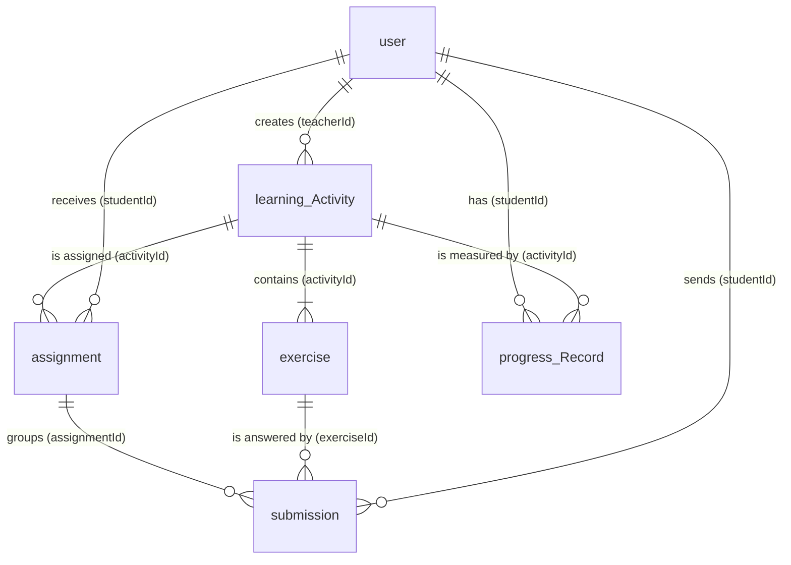

# `math_learning_path` Data Model

MongoDB database for a math learning platform: teachers create activities, assign them to students, and student progress is tracked.

---

## 1. 30-Second Summary

1. A **teacher** (`user`) creates an **activity** (`learning_Activity`).
2. The activity contains several **exercises** (`exercise`).
3. The teacher **assigns** the activity to students (`assignment`).
4. The student sends **answers** (`submission`), one per exercise and attempt.
5. The system updates the **progress** (`progress_Record`).

---

## 2. Relationship Diagram

---

## 3. Relationship Table

| Collection | Field | Points to | Type | Description |
|---|---|---|---|---|
| `learning_Activity` | `teacherId` | `user` (teacher) | N:1 | Identifies which teacher created the activity. One teacher can create many activities. |
| `exercise` | `activityId` | `learning_Activity` | N:1 | Links each exercise to the activity it belongs to. One activity has many exercises. |
| `assignment` | `activityId` | `learning_Activity` | N:1 | Indicates which activity is being assigned. The same activity can be assigned many times. |
| `assignment` | `studentId` | `user` (student) | N:1 | Indicates which student receives the assignment. One student can have many assignments. |
| `submission` | `exerciseId` | `exercise` | N:1 | Indicates which exercise the answer is for. One exercise can have many submissions. |
| `submission` | `studentId` | `user` (student) | N:1 | Identifies the student who sent the answer. |
| `submission` | `assignmentId` | `assignment` | N:1 | Places the answer within the assignment it belongs to, grouping all answers for that assignment. |
| `progress_Record` | `studentId` | `user` (student) | N:1 | Identifies the student whose progress is being summarized. |
| `progress_Record` | `activityId` | `learning_Activity` | N:1 | Identifies the activity on which progress is measured. There is one record per student-activity pair. |

> **Note:** `assignment` is the junction table of the **N:N** relationship between activities and students.

---

## 4. Collections and Fields

### `user`
Teachers and students. The `role` field tells them apart.

| Field | Type | Detail |
|---|---|---|
| `_id` | ObjectId | Identifier |
| `name` | String | Full name |
| `email` | String | Email address |
| `password` | String | Must be stored hashed |
| `role` | String | `teacher` \| `student` |
| `createdAt` | Date | Creation date |

### `learning_Activity`
Learning activity created by a teacher.

| Field | Type | Detail |
|---|---|---|
| `_id` | ObjectId | Identifier |
| `title` | String | Title |
| `description` | String | Description |
| `objective` | String | Learning objective |
| `difficulty` | String | `easy` \| `medium` \| ... |
| `teacherId` | ObjectId | Ref. → `user` |
| `status` | String | E.g. `active` |
| `createdAt` / `updatedAt` | Date | Audit dates |

### `exercise`
Individual question within an activity.

| Field | Type | Detail |
|---|---|---|
| `_id` | ObjectId | Identifier |
| `activityId` | ObjectId | Ref. → `learning_Activity` |
| `prompt` | String | Question statement |
| `answerRules` | Object | Validation rules (see below) |
| `createdAt` / `updatedAt` | Date | Audit dates |

**`answerRules`**

| Field | Type | Detail |
|---|---|---|
| `type` | String | E.g. `numeric` |
| `expected` | String | Expected answer |
| `tolerance` | Number | Optional. Accepted margin of error |

### `assignment`
Assignment of an activity to a student.

| Field | Type | Detail |
|---|---|---|
| `_id` | ObjectId | Identifier |
| `activityId` | ObjectId | Ref. → `learning_Activity` |
| `studentId` | ObjectId | Ref. → `user` |
| `status` | String | `in_progress` \| `completed` |
| `assignedAt` | Date | Assignment date |
| `dueAt` | Date | Due date |

### `submission`
A student's answer to an exercise.

| Field | Type | Detail |
|---|---|---|
| `_id` | ObjectId | Identifier |
| `exerciseId` | ObjectId | Ref. → `exercise` |
| `studentId` | ObjectId | Ref. → `user` |
| `assignmentId` | ObjectId | Ref. → `assignment` |
| `answer` | String | Submitted answer |
| `attemptNumber` | Number | Attempt number |
| `isCorrect` | Boolean | Validation result |
| `status` | String | E.g. `graded` |
| `submittedAt` | Date | Submission date |

### `progress_Record`
Summary of a student's progress in an activity.

| Field | Type | Detail |
|---|---|---|
| `_id` | ObjectId | Identifier |
| `studentId` | ObjectId | Ref. → `user` |
| `activityId` | ObjectId | Ref. → `learning_Activity` |
| `totalExercises` | Number | Total number of exercises |
| `completedExercises` | Number | Exercises completed |
| `completionRate` | Number | From 0 to 1 |
| `status` | String | `in_progress` \| `completed` |
| `lastUpdated` | Date | Last update |

---

## 5. Points to Keep in Mind

- **Students:** IDs `...003` and `...004` are used as `studentId`, but they are missing from the `user` samples. Add users with `role: "student"`.
- **Passwords:** store them hashed (e.g. bcrypt), never as plain text.
- **Duplicated status:** `status` exists in both `assignment` and `progress_Record`. Define which is the source of truth or keep them in sync.
- **References:** MongoDB does not validate `ObjectId` references; validate them in the application (e.g. Mongoose `ref` / `populate`).
- **Naming:** unify the naming convention (`learning_Activity` and `progress_Record` mix `snake_case` and capital letters).
- **Suggested unique indexes:**
  - `assignment`: (`studentId`, `activityId`)
  - `progress_Record`: (`studentId`, `activityId`)
  - `submission`: (`studentId`, `exerciseId`, `attemptNumber`)